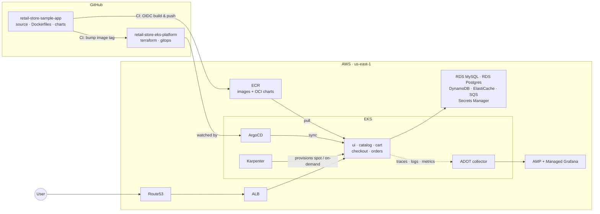

# retail-store-eks-platform

A production-shaped AWS EKS platform for a five-service retail application: layered Terraform,
Karpenter node autoscaling (on-demand + spot with interruption handling), an AWS-managed data
plane (RDS, DynamoDB, ElastiCache, SQS, Secrets Manager), pull-based delivery via ArgoCD, and
observability through the AWS Distro for OpenTelemetry into Amazon Managed Prometheus and
Amazon Managed Grafana.

> **Status:** actively being built — see the [build order](#build-order) below. Layers land one
> pull request at a time; nothing here is claimed to be finished until it's merged.

The application deployed onto this platform is Amazon's open-source
[retail-store-sample-app](https://github.com/aws-containers/retail-store-sample-app); this repo
carries none of its source. My fork, which adds CI/CD, lives at
[MomtezMdimagh/retail-store-sample-app](https://github.com/MomtezMdimagh/retail-store-sample-app).

## Architecture

## Repository layout

| Path | Purpose |
|---|---|
| `bootstrap/` | Run once, by hand: S3 state backend, GitHub OIDC deploy role, ECR repositories |
| `infrastructure/modules/` | Reusable Terraform modules (vpc, eks-cluster, eks-addons, karpenter, data-plane, observability) |
| `infrastructure/live/<env>/` | Thin per-environment, per-layer roots — each is a module call plus backend and tfvars |
| `platform/` | Cluster-level manifests (Karpenter NodePools, ADOT collectors) — applied by ArgoCD, not `kubectl` |
| `gitops/` | ArgoCD app-of-apps, per-service Applications, and Helm values per environment |
| `docs/` | Architecture notes, ADRs, runbooks, cost tracking, teardown checklist |

## Build order

One pull request per layer, in dependency order: bootstrap → VPC → EKS cluster → EKS add-ons →
Karpenter → data plane → ArgoCD → observability → HPA → prod environment → docs.

## License

[MIT](LICENSE). See [NOTICE.md](NOTICE.md) for third-party attribution.
