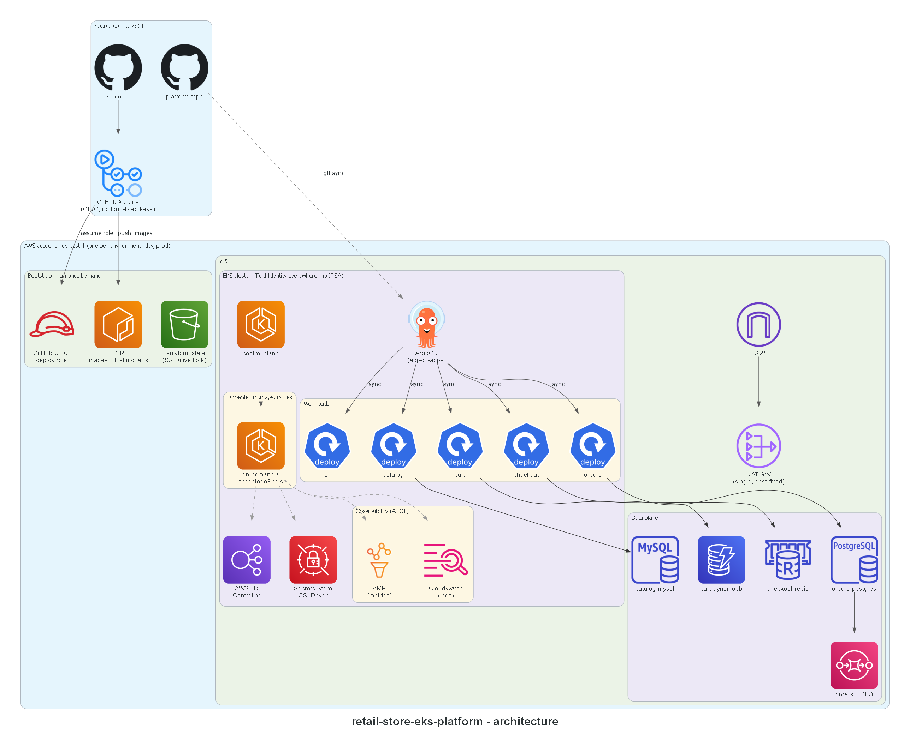

# retail-store-eks-platform

A production-shaped AWS EKS platform for a five-service retail application: layered Terraform
with per-layer remote state, Karpenter node autoscaling (on-demand + spot with interruption
handling), an AWS-managed data plane (RDS, DynamoDB, ElastiCache, SQS), pull-based delivery via
ArgoCD, and observability through the AWS Distro for OpenTelemetry into Amazon Managed
Prometheus. Two environments (`dev`, `prod`) are built from the exact same modules, parameterized
per environment rather than duplicated.

The application deployed onto this platform is Amazon's open-source
[retail-store-sample-app](https://github.com/aws-containers/retail-store-sample-app); this repo
carries none of its source. A fork that adds CI/CD for it lives at
[MomtezMdimagh/retail-store-sample-app](https://github.com/MomtezMdimagh/retail-store-sample-app).

**Status:** both environments are fully built and validated (`terraform validate` / `plan` clean
against real remote state) but deliberately **not applied** — nothing here is running live yet.
Applying is a manual, cost-conscious decision left for when the platform is actually needed, not
something CI or a merge triggers automatically.

## Architecture

The diagram shows one environment's shape — `dev` and `prod` are structurally identical, built
from the same Terraform modules and the same GitOps manifests, differing only in their `tfvars`
(CIDR, retention windows, deletion protection) and their own isolated state, cluster, and ArgoCD
instance. Design rationale for the decisions below is being written up as ADRs under
[`docs/adr/`](docs/adr/) (in progress).

## Key design decisions

- **EKS Pod Identity everywhere, no IRSA.** Every workload-to-AWS-service permission (RDS
  secrets, SQS, DynamoDB, ECR) goes through Pod Identity associations, not OIDC-federated roles.
- **Layered Terraform, one state file per layer.** `infrastructure/modules/` holds
  environment-agnostic logic; `infrastructure/live/<env>/<NN-layer>/` are thin roots. Each layer
  reads its dependencies via `terraform_remote_state`, never by hardcoding another layer's values.
- **GitOps app-of-apps, split by what's actually shared.** `platform/` holds manifests every
  environment's ArgoCD instance syncs identically (NodePools, the AppProject); anything with a
  real environment-specific value (an `EC2NodeClass`, a metrics endpoint) lives under
  `gitops/environments/<env>/platform/` instead.
- **Promotion to prod is a reviewed PR, not a pipeline.** CI auto-writes `dev`'s image tags on
  every build; nothing writes to `prod`'s. Moving a proven tag to `prod` is a manual, reviewed
  change - the exact steps land as a runbook under `docs/runbooks/` (in progress).
- **One NAT gateway, on purpose.** A fixed, known cost instead of one-per-AZ high availability
  this project doesn't need.

## Repository layout

| Path | Purpose |
|---|---|
| [`bootstrap/`](bootstrap/) | Run once, by hand: S3 state backend, GitHub OIDC deploy role, ECR repositories |
| [`infrastructure/modules/`](infrastructure/modules/) | Reusable Terraform modules ([vpc](infrastructure/modules/vpc/), [eks-cluster](infrastructure/modules/eks-cluster/), [eks-addons](infrastructure/modules/eks-addons/), [karpenter](infrastructure/modules/karpenter/), [data-plane](infrastructure/modules/data-plane/), [argocd](infrastructure/modules/argocd/), [observability](infrastructure/modules/observability/)) |
| [`infrastructure/live/`](infrastructure/live/) | Thin per-environment, per-layer roots — each is a module call plus backend and tfvars, for both [`dev`](infrastructure/live/dev/) and [`prod`](infrastructure/live/prod/) |
| [`platform/`](platform/) | Cluster-level manifests shared by every environment ([Karpenter](platform/karpenter/) NodePools, [ADOT](platform/observability/) collectors, [ArgoCD](platform/argocd/) AppProject) — applied by ArgoCD, not `kubectl` |
| [`gitops/`](gitops/) | ArgoCD app-of-apps: per-service Applications, Helm values, and environment-specific platform manifests, for [`dev`](gitops/environments/dev/) and [`prod`](gitops/environments/prod/) |
| [`docs/`](docs/) | Architecture diagrams, ADRs, runbooks, cost tracking, teardown checklist |

## Build order

One pull request per layer, in dependency order: bootstrap → VPC → EKS cluster → EKS add-ons →
Karpenter → data plane → ArgoCD → observability → HPA/PDB → prod environment → docs.

## License

[MIT](LICENSE). See [NOTICE.md](NOTICE.md) for third-party attribution.
