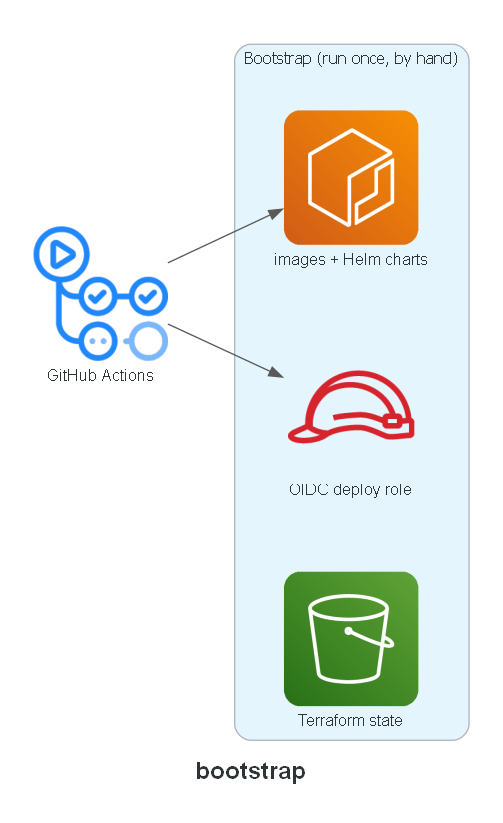

# Bootstrap

Run-once, by hand, ahead of everything else: the small set of AWS resources every other layer
depends on but none of them can create for themselves — where Terraform stores its own state, the
identity CI uses to deploy, and the registries images and charts get pushed to.

**Built in:** PR 2 — `feat/bootstrap`

## Expected contents

- `state-backend.tf` — S3 bucket for remote Terraform state, versioned, encrypted, native locking
- `github-oidc.tf` — GitHub Actions OIDC provider + a deploy role trusted only by this project's repos
- `ecr.tf` — ECR repositories for each service's container image and each service's Helm chart
- `variables.tf`, `outputs.tf`, `versions.tf`

## Status

Done.
