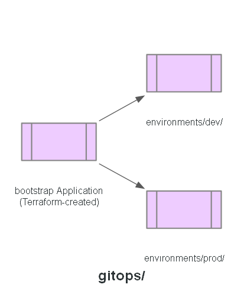

# GitOps

The desired state ArgoCD reconciles against: one Application per service, plus a `platform`
Application, per environment. The one bootstrap Application that owns every other Application is
created by `modules/argocd` via Terraform - the one deliberate exception to
"everything here is GitOps-managed," so it's never a step a person can forget.

## Structure

- `environments/<env>/applications/` — one ArgoCD Application per service, plus `platform.yaml`
- `environments/<env>/values/` — Helm values per service; CI updates the image tag here on every build
- `environments/<env>/manifests/` — anything that isn't a Helm chart or an Application (e.g. a
  SecretProviderClass, since ARNs differ per environment)
- `environments/<env>/platform/` — the handful of `platform/` manifests that hardcode an
  environment-specific value (cluster name, AMP endpoint) and so can't live in the shared
  `platform/` directory; `platform.yaml` in this same environment syncs both

## Status

Implemented.
