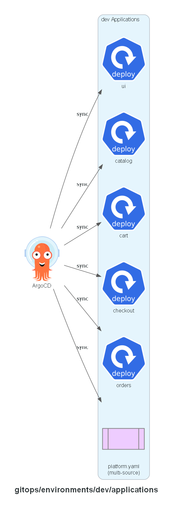

# GitOps: dev applications

One ArgoCD Application per service, plus `platform.yaml` (multi-source: the shared `platform/`
directory and this environment's own `platform/`). Auto-sync with prune and self-heal enabled —
drift between the cluster and this directory corrects itself.

## Expected contents

- `platform.yaml`
- `catalog.yaml`, `cart.yaml`, `checkout.yaml`, `orders.yaml`, `ui.yaml`

**Built in:** PR 8 — `feat/argocd`

## Status

Implemented.
