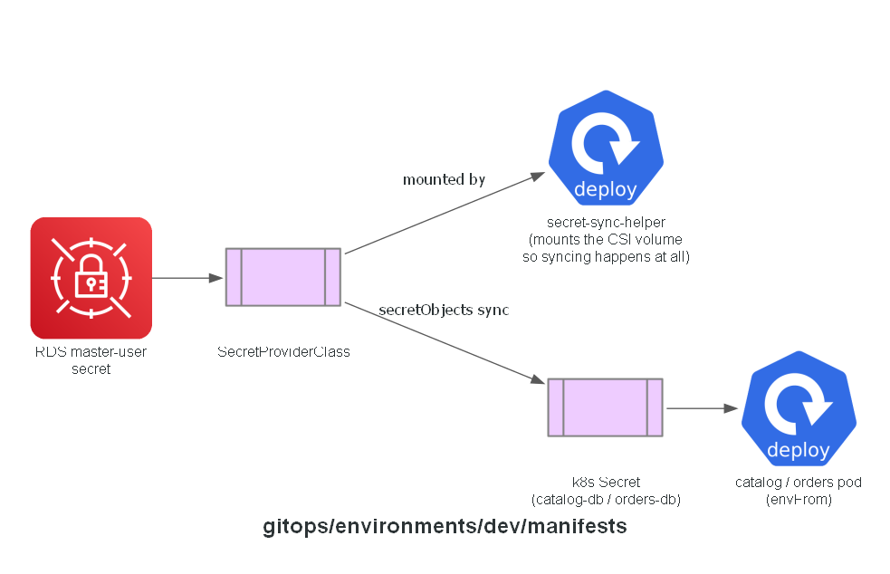

# GitOps: dev manifests

Anything needed by the running services that isn't a Helm chart value or an ArgoCD Application:
`SecretProviderClass` resources that map RDS-managed master-user secrets into Kubernetes Secrets
with the exact keys each chart's `envFrom` expects, plus the small helper Deployments that keep
the CSI driver actually syncing them (it only syncs while *something* mounts the volume, and the
vendored charts don't mount one themselves - see the comments in `secret-sync-helper.yaml`).

Only `catalog` and `orders` need one - `cart` is DynamoDB, IAM-only, no credential to deliver;
`checkout`'s Redis dropped its AUTH token entirely (the vendored checkout chart has no way to use
one anyway), so its endpoint is just a plain value in `values-checkout.yaml`, not a secret.

## Expected contents

- `secretproviderclass-catalog.yaml`, `secretproviderclass-orders.yaml`
- `secret-sync-helper.yaml`

**Built in:** PR 8 — `feat/argocd` (scaffolded, empty). Actually built while writing
`docs/runbooks/deploy.md` for the first real end-to-end run - real work, not a checkbox.

## Status

Implemented.
