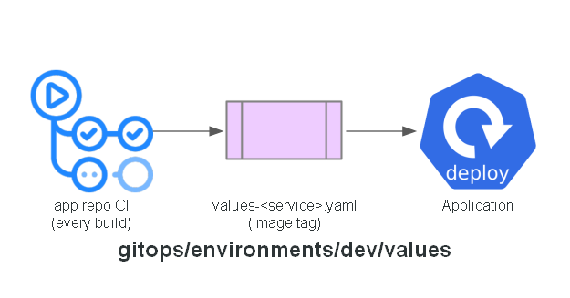

# GitOps: dev values

Helm values for each service, dev environment. Each service's CI pipeline updates its `image.tag`
field here on every successful build — this file is the source of truth for what's running, not
the chart's own default. Autoscaling (CPU-only targets, since `ui`/`cart`/`orders` are JVM-based)
and a percentage-based `podDisruptionBudget` are set here too; `checkout`/`orders` pin to
on-demand capacity, the rest are free for Karpenter to place on spot.

## Expected contents

- `values-catalog.yaml`, `values-cart.yaml`, `values-checkout.yaml`, `values-orders.yaml`, `values-ui.yaml`

**Built in:** PR 8 — `feat/argocd` (image tag updates start arriving via PR 9's CI, autoscaling
values added in PR 11)

## Status

Implemented with placeholder image tags - PR 9's CI starts writing real ones.
