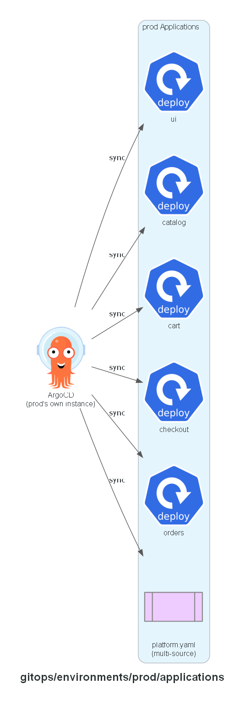

# GitOps: prod applications

One ArgoCD Application per service, plus `platform.yaml` which syncs the shared `platform/`
directory and this environment's own `../platform/` directory. Auto-sync with prune and
self-heal enabled — drift between the cluster and this directory corrects itself.

Unlike dev, no CI writes to this environment's `values/` files — see `../values/README.md` for
the promotion model.

## Expected contents

- `platform.yaml`
- `catalog.yaml`, `cart.yaml`, `checkout.yaml`, `orders.yaml`, `ui.yaml`

**Built in:** PR 12 — `feat/prod-env`

## Status

Implemented.
