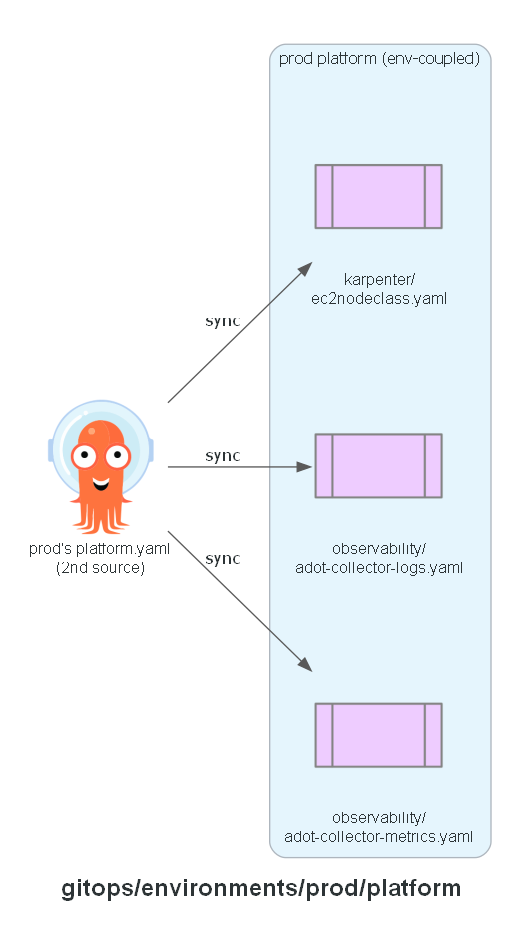

# GitOps: prod platform

The `platform/` manifests that are genuinely coupled to this environment — a cluster name, VPC
tags, a Karpenter node role name, or an AMP remote-write endpoint — and so can't live in the
shared `platform/` directory at the repo root. Synced by this environment's `platform.yaml`
Application as a second source, alongside the shared directory.

## Expected contents

- `karpenter/ec2nodeclass.yaml`
- `observability/adot-collector-logs.yaml`, `observability/adot-collector-metrics.yaml`

**Built in:** PR 12 — `feat/prod-env`

## Status

Manifests committed. Not yet applied - `infrastructure/live/prod/` is build/validate-only this
round; `adot-collector-metrics.yaml`'s remote-write endpoint stays a placeholder until
`infrastructure/live/prod/70-observability` is actually applied.
