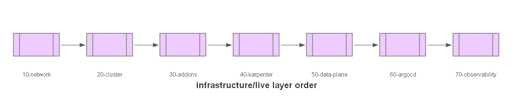

# Infrastructure

All Terraform for the platform, split into two layers: **`modules/`** (reusable,
environment-agnostic resource logic) and **`live/<env>/<NN-layer>/`** (thin per-environment
roots — a module call plus backend config and `.tfvars`, no resources of their own). Layers are
numbered by dependency order and applied in that order.

## Status

All seven layers are implemented for both `dev` and `prod` — see each module's own README for
what it owns and which PR delivered it.
