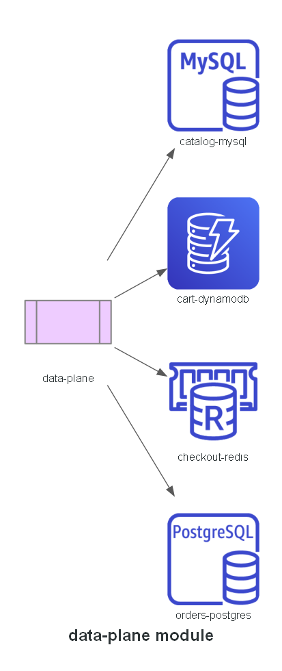

# Module: data-plane

The application's AWS-managed backing services, one sub-module per service. Nothing is
self-hosted in the cluster — every database, cache, and queue is a real managed AWS resource, with
credentials delivered via Secrets Manager and EKS Pod Identity, never baked into values files.

- `catalog-mysql/` — RDS MySQL
- `cart-dynamodb/` — DynamoDB table
- `checkout-redis/` — ElastiCache Redis
- `orders-postgres/` — RDS Postgres + SQS

**Built in:** PR 7 — `feat/data-plane`

## Status

Implemented.
