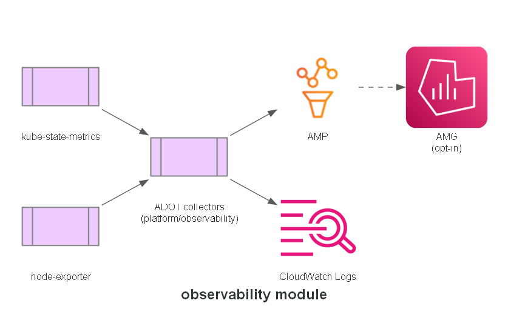

# Module: observability

The AWS-managed side of the observability stack: cert-manager, the ADOT EKS add-on and its IAM
role, node-exporter, kube-state-metrics, an Amazon Managed Prometheus workspace, and an Amazon
Managed Grafana workspace. Collector configuration itself lives in `platform/observability/`.

**Built in:** PR 10 — `feat/observability`

## Status

Implemented. Amazon Managed Grafana is opt-in (`enable_managed_grafana`, default `false`) - it
requires IAM Identity Center already enabled on this account, a one-time manual, account-wide
setting outside this module's control.

<!-- BEGIN_TF_DOCS -->
## Requirements

| Name | Version |
| ---- | ------- |
|  [terraform](#requirement\_terraform) | >= 1.9.0 |
|  [aws](#requirement\_aws) | >= 6.0 |

## Providers

| Name | Version |
| ---- | ------- |
|  [aws](#provider\_aws) | 6.66.0 |

## Modules

No modules.

## Resources

| Name | Type |
| ---- | ---- |
| [aws_cloudwatch_log_group.observability](https://registry.terraform.io/providers/hashicorp/aws/latest/docs/resources/cloudwatch_log_group) | resource |
| [aws_eks_addon.adot](https://registry.terraform.io/providers/hashicorp/aws/latest/docs/resources/eks_addon) | resource |
| [aws_eks_addon.cert_manager](https://registry.terraform.io/providers/hashicorp/aws/latest/docs/resources/eks_addon) | resource |
| [aws_eks_addon.kube_state_metrics](https://registry.terraform.io/providers/hashicorp/aws/latest/docs/resources/eks_addon) | resource |
| [aws_eks_addon.node_exporter](https://registry.terraform.io/providers/hashicorp/aws/latest/docs/resources/eks_addon) | resource |
| [aws_eks_pod_identity_association.logs](https://registry.terraform.io/providers/hashicorp/aws/latest/docs/resources/eks_pod_identity_association) | resource |
| [aws_eks_pod_identity_association.metrics](https://registry.terraform.io/providers/hashicorp/aws/latest/docs/resources/eks_pod_identity_association) | resource |
| [aws_eks_pod_identity_association.traces](https://registry.terraform.io/providers/hashicorp/aws/latest/docs/resources/eks_pod_identity_association) | resource |
| [aws_grafana_workspace.this](https://registry.terraform.io/providers/hashicorp/aws/latest/docs/resources/grafana_workspace) | resource |
| [aws_iam_policy.amg_read](https://registry.terraform.io/providers/hashicorp/aws/latest/docs/resources/iam_policy) | resource |
| [aws_iam_policy.logs](https://registry.terraform.io/providers/hashicorp/aws/latest/docs/resources/iam_policy) | resource |
| [aws_iam_policy.metrics](https://registry.terraform.io/providers/hashicorp/aws/latest/docs/resources/iam_policy) | resource |
| [aws_iam_policy.traces](https://registry.terraform.io/providers/hashicorp/aws/latest/docs/resources/iam_policy) | resource |
| [aws_iam_role.amg](https://registry.terraform.io/providers/hashicorp/aws/latest/docs/resources/iam_role) | resource |
| [aws_iam_role.logs](https://registry.terraform.io/providers/hashicorp/aws/latest/docs/resources/iam_role) | resource |
| [aws_iam_role.metrics](https://registry.terraform.io/providers/hashicorp/aws/latest/docs/resources/iam_role) | resource |
| [aws_iam_role.traces](https://registry.terraform.io/providers/hashicorp/aws/latest/docs/resources/iam_role) | resource |
| [aws_iam_role_policy_attachment.amg_read](https://registry.terraform.io/providers/hashicorp/aws/latest/docs/resources/iam_role_policy_attachment) | resource |
| [aws_iam_role_policy_attachment.logs](https://registry.terraform.io/providers/hashicorp/aws/latest/docs/resources/iam_role_policy_attachment) | resource |
| [aws_iam_role_policy_attachment.metrics](https://registry.terraform.io/providers/hashicorp/aws/latest/docs/resources/iam_role_policy_attachment) | resource |
| [aws_iam_role_policy_attachment.traces](https://registry.terraform.io/providers/hashicorp/aws/latest/docs/resources/iam_role_policy_attachment) | resource |
| [aws_prometheus_workspace.this](https://registry.terraform.io/providers/hashicorp/aws/latest/docs/resources/prometheus_workspace) | resource |
| [aws_caller_identity.current](https://registry.terraform.io/providers/hashicorp/aws/latest/docs/data-sources/caller_identity) | data source |
| [aws_iam_policy_document.amg_assume](https://registry.terraform.io/providers/hashicorp/aws/latest/docs/data-sources/iam_policy_document) | data source |
| [aws_iam_policy_document.amg_read](https://registry.terraform.io/providers/hashicorp/aws/latest/docs/data-sources/iam_policy_document) | data source |
| [aws_iam_policy_document.logs](https://registry.terraform.io/providers/hashicorp/aws/latest/docs/data-sources/iam_policy_document) | data source |
| [aws_iam_policy_document.metrics](https://registry.terraform.io/providers/hashicorp/aws/latest/docs/data-sources/iam_policy_document) | data source |
| [aws_iam_policy_document.pod_identity_assume](https://registry.terraform.io/providers/hashicorp/aws/latest/docs/data-sources/iam_policy_document) | data source |
| [aws_iam_policy_document.traces](https://registry.terraform.io/providers/hashicorp/aws/latest/docs/data-sources/iam_policy_document) | data source |
| [aws_region.current](https://registry.terraform.io/providers/hashicorp/aws/latest/docs/data-sources/region) | data source |

## Inputs

| Name | Description | Type | Default | Required |
| ---- | ----------- | ---- | ------- | :------: |
|  [adot\_addon\_version](#input\_adot\_addon\_version) | adot addon version - check AWS's currently supported versions before setting | `string` | n/a | yes |
|  [cert\_manager\_addon\_version](#input\_cert\_manager\_addon\_version) | cert-manager addon version - check AWS's currently supported versions before setting | `string` | n/a | yes |
|  [cluster\_name](#input\_cluster\_name) | EKS cluster name observability is installed into | `string` | n/a | yes |
|  [enable\_managed\_grafana](#input\_enable\_managed\_grafana) | Create the Amazon Managed Grafana workspace. Requires IAM Identity Center already enabled on this account (a one-time, account-wide, manual setting) - leave false until that's done, since AMG creation will otherwise fail at apply time | `bool` | `false` | no |
|  [environment\_name](#input\_environment\_name) | Environment name used in resource names and tags | `string` | `"dev"` | no |
|  [kube\_state\_metrics\_addon\_version](#input\_kube\_state\_metrics\_addon\_version) | kube-state-metrics addon version - check AWS's currently supported versions before setting | `string` | n/a | yes |
|  [log\_retention\_days](#input\_log\_retention\_days) | Retention for the application traces/logs CloudWatch log group | `number` | `14` | no |
|  [node\_exporter\_addon\_version](#input\_node\_exporter\_addon\_version) | prometheus-node-exporter addon version - check AWS's currently supported versions before setting | `string` | n/a | yes |
|  [tags](#input\_tags) | Tags applied to every resource this module creates | `map(string)` | <pre>{   "Terraform": "true" }</pre> | no |

## Outputs

| Name | Description |
| ---- | ----------- |
|  [amp\_remote\_write\_endpoint](#output\_amp\_remote\_write\_endpoint) | Full remote-write URL for the metrics collector config in platform/observability/ |
|  [amp\_workspace\_id](#output\_amp\_workspace\_id) | n/a |
|  [grafana\_workspace\_endpoint](#output\_grafana\_workspace\_endpoint) | null until enable\_managed\_grafana is true and IAM Identity Center is enabled on this account |
|  [log\_group\_name](#output\_log\_group\_name) | n/a |
|  [region](#output\_region) | n/a |
<!-- END_TF_DOCS -->
