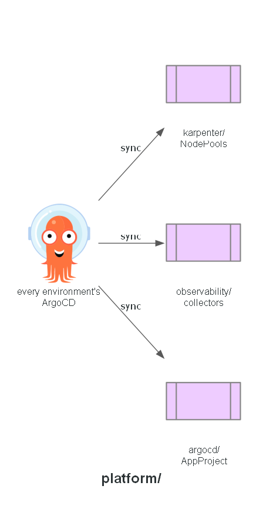

# Platform

Cluster-level Kubernetes manifests shared identically by every environment's ArgoCD instance:
node provisioning policy, observability collector configuration, and the AppProject. Applied by
ArgoCD, not by hand — the only manual `kubectl apply` in this project is the one-time app-of-apps
bootstrap in `gitops/`.

## Expected contents

- `karpenter/` — node provisioning: NodePools (on-demand, spot)
- `observability/` — shared ADOT collector configuration and instrumentation
- `argocd/` — the AppProject definition

## Status

Manifests committed across all three subfolders. Not yet applied - see each subfolder's own
status.
