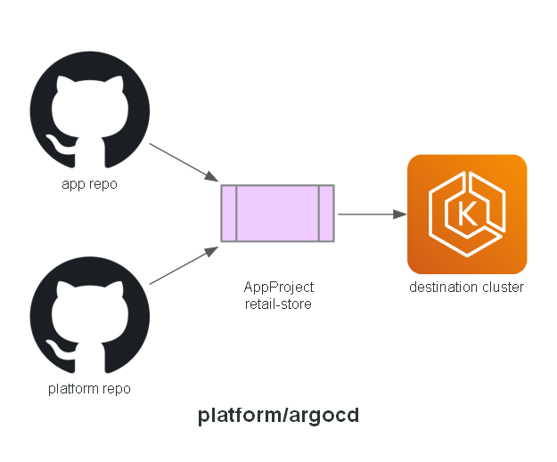

# Platform: argocd

The AppProject that scopes what the Applications in `gitops/` are allowed to deploy. ArgoCD's own
installation is Terraform-managed (`infrastructure/modules/argocd`) - this folder only holds the
one manifest that has to live inside `platform/` so each environment's `platform.yaml`
Application (which recursively syncs `platform/`) picks it up too.

## Expected contents

- `appproject-retail-store.yaml`

**Built in:** PR 8 — `feat/argocd`

## Status

Implemented.
