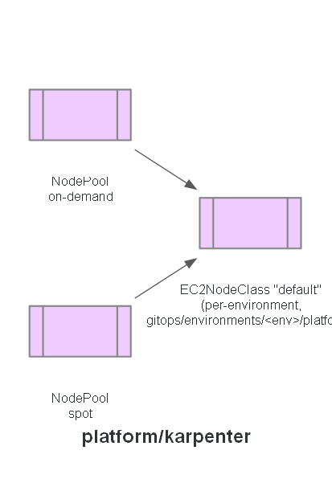

# Platform: karpenter

Node provisioning policy, applied by ArgoCD: two NodePools — one on-demand, one spot — so
workloads that tolerate interruption run on cheaper capacity while critical ones stay on-demand.
Both reference an `EC2NodeClass` named `default` by logical name only, so they stay
environment-agnostic here; the `EC2NodeClass` itself lives per-environment (it hardcodes a cluster
name, VPC tags, and a node role name) at `gitops/environments/<env>/platform/karpenter/`.

## Expected contents

- `nodepool-ondemand.yaml`
- `nodepool-spot.yaml`

**Built in:** PR 6 — `feat/karpenter`. `ec2nodeclass.yaml` moved out to per-environment
`gitops/` directories in PR 12 — `feat/prod-env`.

## Status

Manifests committed. Not yet applied - ArgoCD (PR 8) is what will actually apply these to the
cluster; per this repo's own convention, `platform/` is never `kubectl apply`-ed directly.
