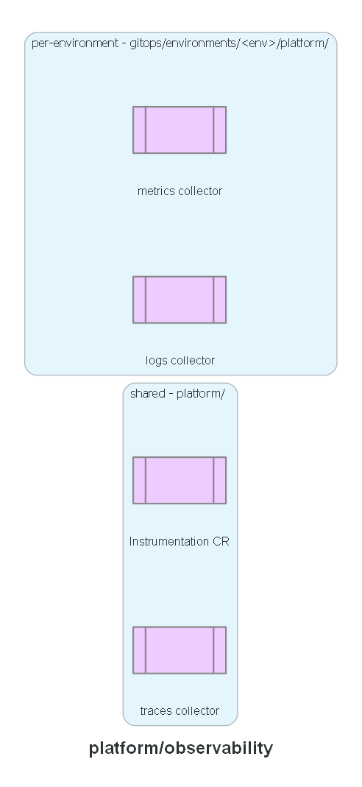

# Platform: observability

ADOT collector configuration: what each collector scrapes or receives, and where it forwards
traces, logs, and metrics. The traces collector and the `Instrumentation` CR carry no
environment-specific values, so they stay here, shared across every environment's ArgoCD instance.
`adot-collector-logs.yaml` and `adot-collector-metrics.yaml` live per-environment instead (they
hardcode a log group name and an AMP endpoint), at `gitops/environments/<env>/platform/observability/`.

## Expected contents

- `namespace.yaml`
- `collector-serviceaccounts.yaml` — the three collectors' service accounts (the Pod Identity
  targets) and the metrics collector's read RBAC for Kubernetes service discovery
- `adot-collector-traces.yaml`
- `adot-instrumentation.yaml`

**Built in:** PR 10 — `feat/observability`. `adot-collector-logs.yaml` and
`adot-collector-metrics.yaml` moved out to per-environment `gitops/` directories in PR 12 —
`feat/prod-env`.

## Status

Manifests committed. Not yet applied - ArgoCD's `platform.yaml` Application (PR 8) picks these up
the same way it does Karpenter's. Each environment's `adot-collector-metrics.yaml` remote-write
endpoint is a placeholder until that environment's `70-observability` layer is actually applied.
